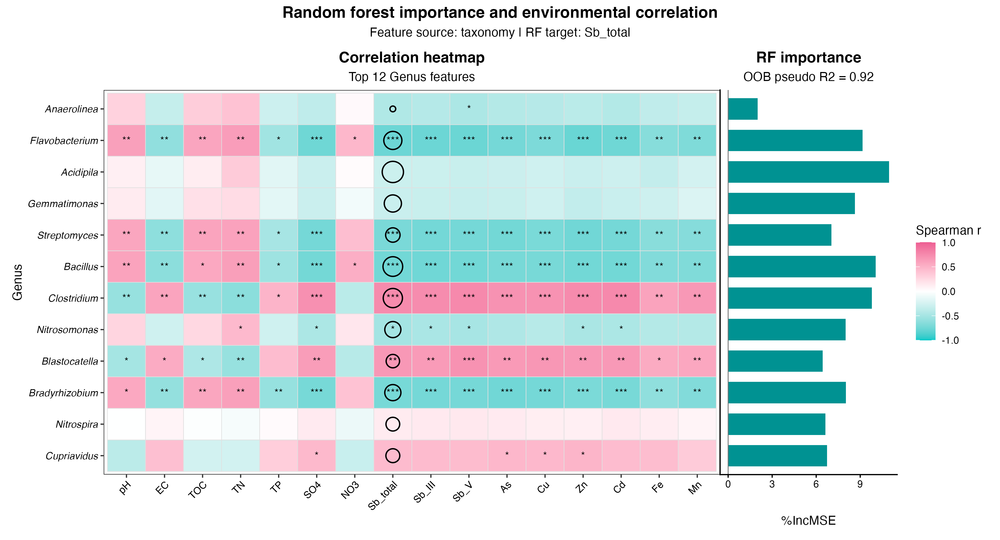
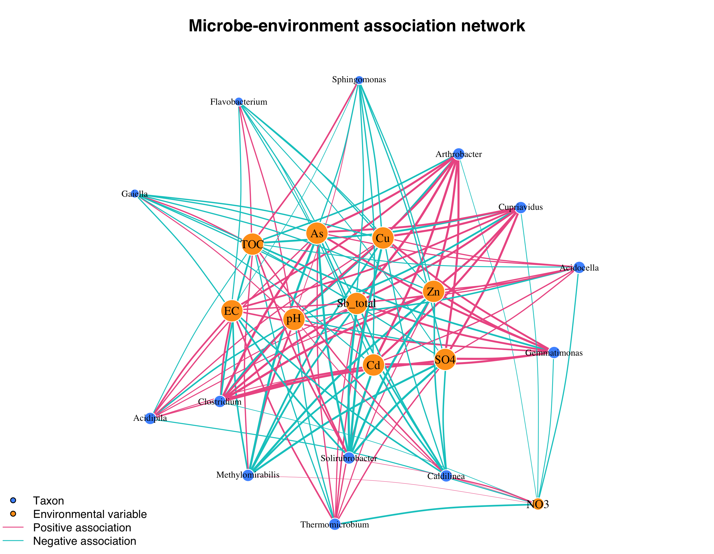
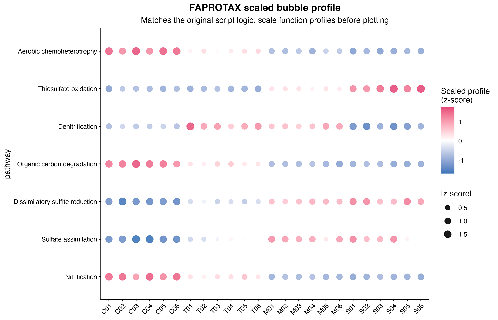
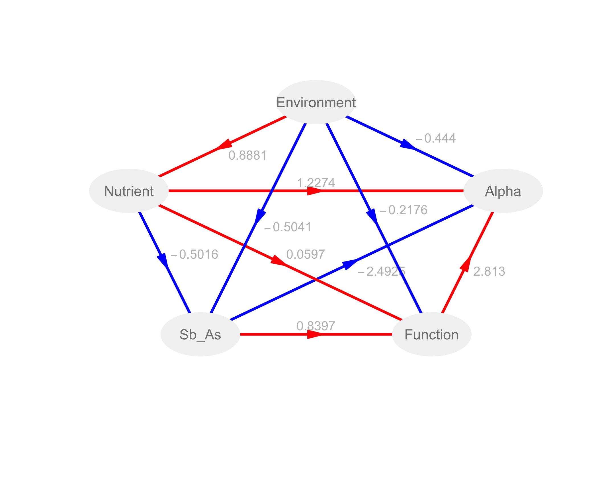
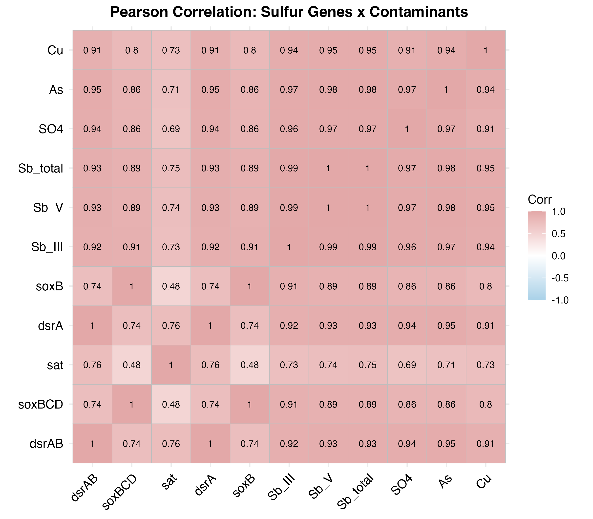
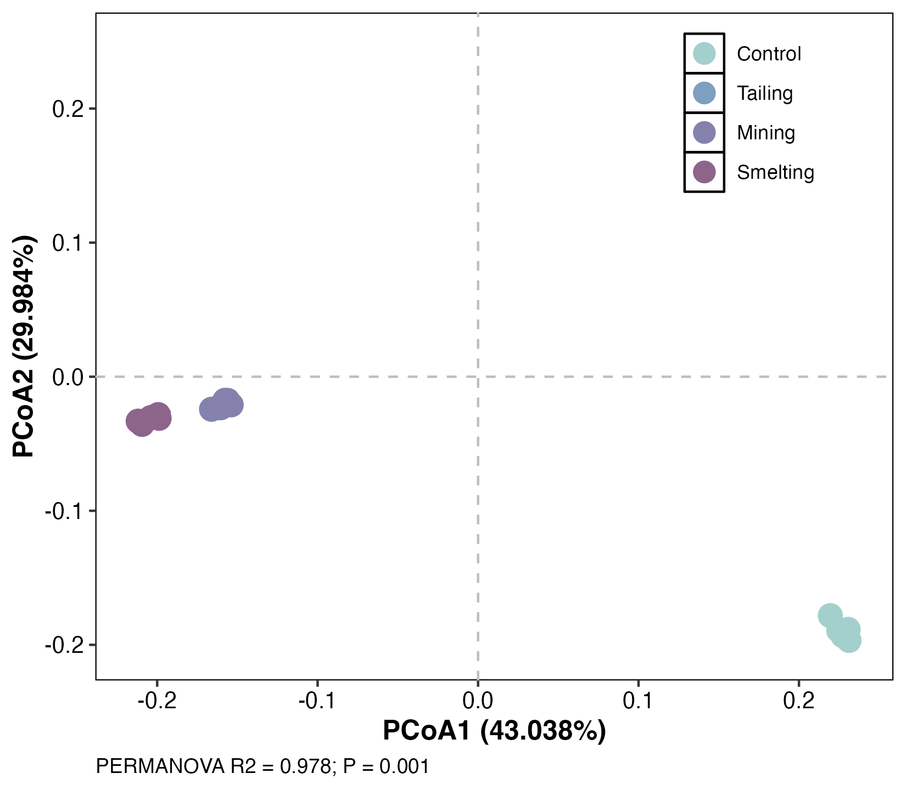
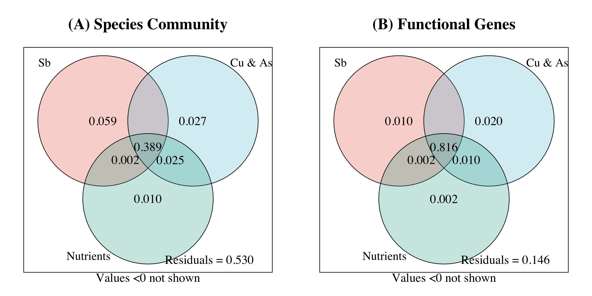

# Soil Microbiome & Contaminant Visualization Demo

## Overview

This repository is a public GitHub portfolio demo for environmental microbiome and contaminant-gradient data visualization in R. It contains 11 independent, reproducible modules that use simulated/desensitized toy data to demonstrate research-style figure workflows for soil microbial communities, environmental variables, contaminant gradients, functional annotations, and mechanism-oriented statistical graphics.

The project is not a paper-result reproduction repository. Public outputs are generated from toy inputs and should be read as demonstrations of analysis structure, visualization logic, and reproducible workflow design rather than as real environmental findings.

## Why this project

Environmental microbiome projects often need to connect community structure, contaminant exposure, soil chemistry, functional profiles, and statistical interpretation in figures that are both reproducible and readable. This demo shows how those figure types can be organized into small R workflows that start from raw-like public toy tables and write their own intermediate results and figures.

The environmental context is centered on Sb/Cu/As contaminant gradients, soil physicochemical variables, microbial community shifts, functional profiles, sulfur and nutrient cycling, and mechanism-oriented interpretation. The emphasis is on clear visualization and transparent workflow design, not on claiming biological conclusions from the simulated data.

## Data privacy and public-data policy

All data intended for public use in this repository are simulated, toy, or desensitized demonstration data. They do not represent real sample measurements, private raw sequencing data, or manuscript-only analysis tables.

The repository is configured so private or raw data paths remain ignored, including `_private_original/`, `raw/`, `private/`, `original_data/`, `data/raw/`, and `data/private/`. Large sequencing/archive formats such as FASTQ, BAM, SAM, compressed archives, and ZIP/TAR files are also ignored. Public modules should not depend on private raw files or copied final plotting tables from a separate research project.

## Repository Structure

```text
.
|-- README.md
|-- docs/
|   |-- data_privacy.md
|   |-- demo_selection.md
|   |-- project_overview.md
|   |-- public_release_checklist.md
|   |-- r_package_requirements.md
|   `-- shared_toy_data_schema.md
|-- scripts/
|   |-- create_shared_toy_data.R
|   `-- run_all_demos.R
|-- data/
|   `-- toy_shared/
`-- 01_... to 11_.../
    |-- README.md
    |-- docs/
    |-- data/toy/
    |-- scripts/run_demo.R
    |-- results/
    `-- figures/
```

Each numbered module is designed to be run from its own folder. Module scripts use `../data/toy_shared/` to read the shared toy dataset and write module-specific outputs to local `results/` and `figures/` folders.

## Shared Toy Dataset

The shared toy dataset is generated by:

```bash
Rscript scripts/create_shared_toy_data.R
```

It writes public demonstration tables to `data/toy_shared/`, including sample metadata, environmental variables, microbial abundance/taxonomy tables, and functional annotation data. The generated tables contain simulated/desensitized environmental microbiome patterns for use across all modules.

## Module overview

| Module | Main capability | Main outputs |
|---|---|---|
| `01_rf_correlation_heatmap` | Random-forest feature screening and contaminant/environment correlation visualization for microbial taxa | Feature-importance table, correlation results, combined RF/correlation figure |
| `02_microbe_env_network` | Microbe-environment association network construction for contaminant and soil-variable gradients | Correlation matrices, node/edge lists, environmental association network |
| `03_ternary_taxa_distribution` | Ternary visualization of taxon distribution across contaminant-context groups | Group mean abundance tables, ternary taxa distribution figure |
| `04_faprotax_functional_profile` | Functional-profile visualization for environmental microbiome interpretation | Functional abundance summaries, z-score bubble profile, group barplots |
| `05_lefse_biomarker` | Biomarker-style taxon screening across environmental groups using toy community data | Candidate statistics, biomarker tables, LDA-style barplots and heatmaps |
| `06_plspm_mechanism_model` | Mechanism-oriented partial least squares path modeling for contaminant, soil, community, and function blocks | Path coefficients, latent scores, model summaries, path-model figure |
| `07_differential_volcano_heatmap` | Differential abundance-style visualization across contaminant groups | Contrast tables, volcano plots, selected-taxon heatmaps |
| `08_kegg_enrichment` | KEGG-style functional enrichment visualization for toy functional annotations | Enrichment result tables, pathway/module bubble and combined plots |
| `09_sulfur_gene_contaminant_association` | Sulfur-cycle gene association analysis against contaminant and soil gradients | Pearson/MLR result tables, heatmap, scatter, and regression summary figures |
| `10_alpha_beta_diversity` | Alpha/beta diversity visualization for soil microbial community structure | Diversity indices, PERMANOVA output, PCoA/NMDS and distance figures |
| `11_vpa_mantel_partitioning` | Variation partitioning and Mantel-style environmental association visualization | VPA fractions, Mantel results, environment-correlation and VPA figures |

## Selected gallery



Random-forest ranking and correlation heatmaps are combined to summarize which microbial features are most strongly associated with simulated contaminant and soil-variable gradients.



The network module shows how microbe-environment associations can be translated into node and edge tables, then visualized as an interpretable environmental association graph.



The functional-profile view demonstrates how microbial functional annotations can be summarized across environmental groups without treating the toy trends as real biological conclusions.



The mechanism model organizes contaminant exposure, soil conditions, community structure, and functional profiles into a path-model style figure suitable for research-style environmental interpretation.



Sulfur-cycle gene associations are visualized against contaminant and soil gradients to demonstrate mechanism-oriented statistical graphics for environmental microbiome workflows.



The diversity module shows beta-diversity ordination for simulated soil microbial communities across contaminant-context groups.



Variation partitioning summarizes how environmental, contaminant, and spatial-style blocks can be displayed for toy community/function response matrices.

## How to Run

From the repository root, generate or refresh the shared toy data:

```bash
Rscript scripts/create_shared_toy_data.R
```

Run a single module from its own folder:

```bash
cd 01_rf_correlation_heatmap
Rscript scripts/run_demo.R
```

Return to the repository root and run another module:

```bash
cd ..
cd 02_microbe_env_network
Rscript scripts/run_demo.R
```

Module scripts are written to run from their own module directories because they read the shared toy dataset through `../data/toy_shared/`.

An optional root-level helper can run all modules in sequence:

```bash
Rscript scripts/run_all_demos.R
```

The helper prints each module name, continues after a failed module, and reports a passed/failed summary at the end.

## R package requirements

See [docs/r_package_requirements.md](docs/r_package_requirements.md) for a consolidated package list, module-specific dependencies, and installation guidance. Some modules use Bioconductor packages such as `DESeq2`, `ComplexHeatmap`, `clusterProfiler`, and `enrichplot`; others use CRAN packages such as `ggplot2`, `vegan`, `patchwork`, `randomForest`, `igraph`, `ggtern`, `plspm`, and `microeco`.

This repository does not automatically install packages.

## License

This project is released under the [MIT License](LICENSE). The code, simulated toy data, generated demo results, and generated demo figures may be reused under the terms of that license.

## Reproducibility notes

The shared toy-data generator uses a fixed random seed so the public demo inputs can be regenerated. Each module performs its own calculations from toy inputs and writes reproducible CSV results and figure files to the module folder.

For the most predictable behavior, run scripts from the expected working directory:

- `scripts/create_shared_toy_data.R` from the repository root.
- `scripts/run_demo.R` from the corresponding module folder.
- `scripts/run_all_demos.R` from the repository root.

## Limitations

The toy data are designed to be plausible enough for workflow demonstration, but they are not real measurements and should not be interpreted as evidence about any actual site, contaminant exposure, microbial taxon, functional gene, or environmental mechanism.

The modules are intentionally compact and portfolio-oriented. They demonstrate figure logic, dependency organization, and reproducible R workflow structure, but they do not replace full study design, sequencing quality control, statistical validation, or domain-specific review required for a real environmental microbiome project.

## Skills demonstrated

- Reproducible R workflow organization
- Environmental microbiome data visualization
- Contaminant-gradient interpretation with Sb/Cu/As-style variables
- Statistical graphics for taxonomic, functional, and diversity analysis
- Network, ordination, enrichment, differential, and mechanism-model figures
- Public-data hygiene for simulated/desensitized portfolio datasets
- Modular repository design with generated results and figures

## Next steps

- Re-run all modules after dependency installation in a fresh R environment.
- Confirm that no private raw data, manuscript-only files, or large sequencing files are tracked before publishing.
- Review figure captions and module READMEs for consistency with the public-data policy.
- Keep future additions focused on transparent toy-data workflows rather than real unpublished results.
