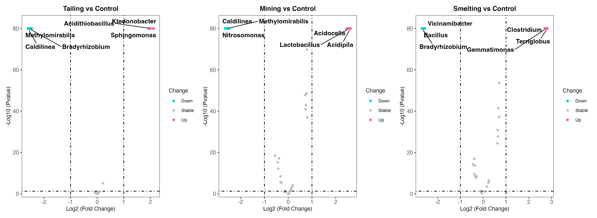
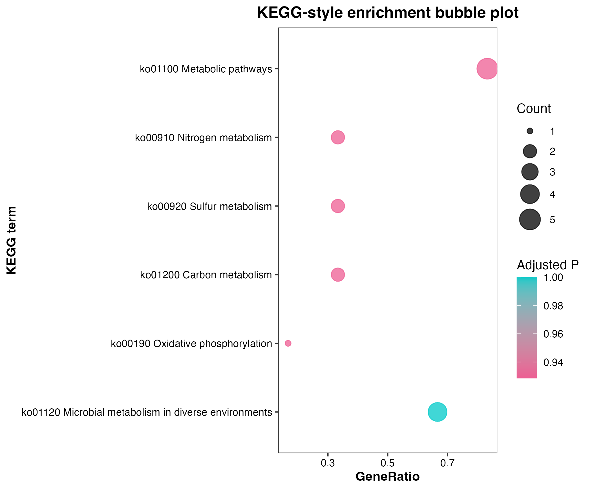

# 土壤微生物与污染梯度可视化演示

语言： [English](README.md) | 中文

## 项目简介

这个仓库是一个适合公开展示的 R 语言作品集项目，用于演示环境微生物和污染梯度数据的可视化组织方式。仓库包含 11 个相互独立、可以复现运行的模块，使用模拟或脱敏的示例数据展示土壤微生物群落、环境变量、污染物梯度、功能注释、多样性、网络、富集分析、机制模型等图形的构建过程。

这个项目不是论文结果复现仓库。公开输出均由示例输入表生成，应理解为分析结构、作图逻辑和可复现项目组织方式的展示，而不是真实环境样点的研究发现。

## 为什么做这个项目

环境微生物项目常常需要在图形中同时连接群落结构、污染暴露、土壤理化性质、功能谱和统计解释。这个演示项目展示了如何把这些常见图形类型整理成小型 R 流程：每个模块都从类似原始输入的公开示例表开始，自己计算中间结果，再生成对应的结果表和图形。

项目背景围绕 Sb / Cu / As 等污染梯度、土壤理化变量、微生物群落变化、功能谱、硫循环与养分循环、以及机制导向的统计解释展开。重点是清晰可复现的可视化和透明的项目组织，而不是从模拟数据中声称生物学结论。

## 发表背景说明

这个作品集仓库受到一篇共同一作环境微生物文章中的可视化经验启发：Responses of soil microbes to antimony stress and coupled nutrient cycling in karst mining areas of southwest China，发表于 _Ecotoxicology and Environmental Safety_ 318, 120248，DOI: [https://doi.org/10.1016/j.ecoenv.2026.120248](https://doi.org/10.1016/j.ecoenv.2026.120248)。

本仓库不是官方论文代码，不复现已发表图件，也不包含真实研究数据或手稿结果。这里的所有示例均使用模拟或脱敏数据，用来展示公开安全的 R 项目组织、统计可视化和图形复现方式。

## 数据隐私与公开数据原则

本仓库中用于公开展示的数据均为模拟数据、示例数据或脱敏演示数据。它们不代表真实样本测量值、私有原始测序数据或未公开分析表。

仓库已配置忽略私有或原始数据路径，包括 `_private_original/`、`raw/`、`private/`、`original_data/`、`raw_data/`、`real_data/`、`private_data/`、`data/raw/` 和 `data/private/`。FASTQ、BAM、SAM、压缩包和大型归档文件等格式也被忽略。公开模块不应依赖私有原始文件，也不应从其他研究项目复制手工整理过的作图表。

本仓库中的演示图均由示例或脱敏输入生成，只用于展示可复现作图流程，不应被视为论文图、真实生物学结果或科学推断证据。KEGG、FAPROTAX、BacMet 等相关示例使用模拟注释，不重新分发外部注释数据库。

## 仓库结构

```text
.
|-- README.md
|-- README.zh-CN.md
|-- docs/
|   |-- data_privacy.md
|   |-- demo_selection.md
|   |-- module_registry.csv
|   |-- output_manifest.csv
|   |-- project_overview.md
|   |-- public_release_checklist.md
|   |-- r_package_requirements.md
|   |-- reproducible_r_environment.md
|   `-- shared_toy_data_schema.md
|-- scripts/
|   |-- check_project_integrity.R
|   |-- create_shared_toy_data.R
|   |-- install_r_dependencies.R
|   |-- run_all_demos.R
|   |-- run_smoke_test.R
|   `-- write_output_manifest.R
|-- data/
|   `-- toy_shared/
`-- 01_... to 11_.../
    |-- README.md
    |-- docs/
    |-- data/toy/
    |-- scripts/run_demo.R
    |-- results/
    `-- figures/
```

每个编号模块都设计为从自己的文件夹运行。模块脚本默认通过 `../data/toy_shared/` 读取共享示例数据，并把模块自己的结果写入本地 `results/` 和 `figures/` 文件夹。

## 共享示例数据

共享示例数据由下面的脚本生成：

```bash
Rscript scripts/create_shared_toy_data.R
```

脚本会把公开演示表写入 `data/toy_shared/`，包括样本信息、环境变量、微生物丰度表、分类注释表和功能注释表。生成的数据包含模拟或脱敏的环境微生物模式，供所有模块共同使用。

生成文件包括：

- `sample_metadata.csv`
- `environmental_variables.csv`
- `taxonomy_table.csv`
- `abundance_table.csv`
- `functional_annotation_table.csv`

## 模块概览

| 模块 | 主要能力 | 主要输出 |
|---|---|---|
| `01_rf_correlation_heatmap` | 随机森林特征筛选，以及微生物特征与污染物/环境变量的相关性热图 | 特征重要性表、相关性结果、随机森林与相关性组合图 |
| `02_microbe_env_network` | 构建微生物-环境变量关联网络 | 相关性矩阵、节点表、边表、环境关联网络图 |
| `03_ternary_taxa_distribution` | 用三元图展示分类单元在不同污染背景组中的分布 | 分组平均丰度表、三元图作图表、三元图 |
| `04_faprotax_functional_profile` | 展示环境微生物功能谱的 FAPROTAX 风格图形 | 功能丰度汇总表、标准化气泡图、分组柱状图 |
| `05_lefse_biomarker` | 用类似 LEfSe 的方式筛选并展示组间差异分类单元 | 候选统计表、标志分类单元表、LDA 风格条形图和热图 |
| `06_plspm_mechanism_model` | 污染物、土壤性质、群落和功能模块的偏最小二乘路径模型图 | 路径系数、潜变量得分、模型汇总、路径模型图 |
| `07_differential_volcano_heatmap` | 展示类似 DESeq2 的差异丰度分析图形 | 对比结果表、火山图、筛选分类单元热图 |
| `08_kegg_enrichment` | 展示 KEGG 风格的功能富集图形 | 富集结果表、通路/模块气泡图和组合图 |
| `09_sulfur_gene_contaminant_association` | 展示硫循环基因与污染物及土壤梯度的关联 | Pearson 相关和多元线性回归结果表、热图、散点图、回归汇总图 |
| `10_alpha_beta_diversity` | 展示土壤微生物 alpha / beta 多样性 | 多样性指数、PERMANOVA 结果、PCoA/NMDS 排序图和距离图 |
| `11_vpa_mantel_partitioning` | 展示变异分解和 Mantel 风格的环境关联图 | 变异分解表、Mantel 结果、环境相关图和变异分解图 |

机器可读的模块清单见 [docs/module_registry.csv](docs/module_registry.csv)。声明输出的清单见 [docs/output_manifest.csv](docs/output_manifest.csv)。

## 已包含的演示图

**随机森林与相关性组合图**


*使用公开安全示例数据展示随机森林特征排序和环境相关性可视化。*

**类似 DESeq2 的差异丰度图形**



*用示例数据展示差异分析火山图的可复现作图结构。*

**PLS-PM 风格机制图**


*用模拟输入展示机制导向路径图的构建方式。*

**KEGG 风格富集图**



*基于模拟功能注释生成的富集气泡图，用于展示流程。*

**beta 多样性排序图**


*用示例群落数据展示 beta 多样性排序图。*

## 如何运行

在准备好的公开 R 环境中，完整运行路径为：

```bash
Rscript scripts/install_r_dependencies.R
Rscript scripts/create_shared_toy_data.R
Rscript scripts/run_all_demos.R
```

依赖安装脚本会安装各模块使用的 CRAN 和 Bioconductor 包。模块脚本本身不会自动安装包；如果缺少依赖，它们会报出缺失包并停止运行，以便环境准备保持显式和可追踪。

如果只想从仓库根目录生成或刷新共享示例数据：

```bash
Rscript scripts/create_shared_toy_data.R
```

运行单个模块：

```bash
cd 01_rf_correlation_heatmap
Rscript scripts/run_demo.R
```

返回仓库根目录后运行另一个模块：

```bash
cd ..
cd 02_microbe_env_network
Rscript scripts/run_demo.R
```

模块脚本应从对应模块文件夹中运行，因为它们通过 `../data/toy_shared/` 读取共享示例数据。

也可以在仓库根目录用辅助脚本按顺序运行全部模块：

```bash
Rscript scripts/run_all_demos.R
```

该脚本会打印每个模块名称，遇到失败时继续运行后续模块，并在最后汇总成功和失败情况。

## 轻量检查

如果想快速检查项目结构、公开安全边界和轻量模块是否正常，可以运行：

```bash
Rscript scripts/run_smoke_test.R
```

这个轻量检查会重新生成共享示例数据，运行不依赖大型 Bioconductor 包的 `01` 到 `04` 模块，检查关键 CSV/PDF/PNG 输出是否生成且非空，运行项目完整性检查，并刷新 `docs/output_manifest.csv`。它不替代完整运行，只用于更快发现结构性问题。

项目完整性检查和输出清单刷新也可以单独运行：

```bash
Rscript scripts/check_project_integrity.R
Rscript scripts/write_output_manifest.R
```

完整性检查会确认共享示例数据是否存在，`sample_id` 和 `feature_id` 的表间关系是否一致，11 个编号模块是否都有 README 和 `scripts/run_demo.R`，R 脚本中是否出现本地绝对路径或私有/原始数据依赖，以及声明的输出文件是否存在。

干净本地环境测试方式见 [docs/reproducible_r_environment.md](docs/reproducible_r_environment.md)。

## R 包需求

整合的依赖列表和模块级依赖说明见 [docs/r_package_requirements.md](docs/r_package_requirements.md)。公开环境运行方式和 GitHub Actions 说明见 [docs/reproducible_r_environment.md](docs/reproducible_r_environment.md)。

大多数模块使用 CRAN 包。`07_differential_volcano_heatmap` 和 `08_kegg_enrichment` 使用 Bioconductor 包，因此完整运行比轻量检查更耗时。

## 许可证

本项目使用 [MIT License](LICENSE)。代码、模拟示例数据、生成的演示结果和演示图形都可在该许可证条款下复用。

## 可复现性说明

共享示例数据生成脚本使用固定随机种子，因此公开演示输入可以重新生成。每个模块都会从示例输入重新计算自己的结果，并把 CSV 结果表和图形文件写入模块文件夹。

为了获得最可预测的行为，建议从指定位置运行脚本：

- `scripts/create_shared_toy_data.R`：从仓库根目录运行；
- `scripts/run_demo.R`：从对应模块文件夹运行；
- `scripts/run_all_demos.R`：从仓库根目录运行；
- `scripts/run_smoke_test.R`：从仓库根目录运行；
- `scripts/check_project_integrity.R`：从仓库根目录运行。

## 项目展示的能力

- 可复现 R 项目组织；
- 环境微生物数据可视化；
- Sb / Cu / As 风格污染梯度解释图；
- 分类、功能和多样性分析的统计图形；
- 网络图、排序图、富集图、差异分析图和机制模型图；
- 面向公开仓库的模拟/脱敏数据管理；
- 使用生成结果和图形的模块化仓库设计。

## 后续建议

- 在新 R 环境中安装依赖后重新运行全部模块；
- 发布前确认没有私有原始数据、未公开分析文件或大型测序文件被跟踪；
- 检查图注和模块 README 是否始终符合公开数据原则；
- 后续新增内容应继续聚焦透明的示例数据流程，而不是引入真实未公开结果。

## 局限性

示例数据被设计得足够合理，以便演示流程和图形结构，但它们不是真实测量值，不能解释为任何真实场地、污染暴露、微生物分类单元、功能基因或环境机制的证据。

这些模块有意保持紧凑，适合作品集展示。它们展示的是图形逻辑、依赖组织和可复现 R 项目结构，不能替代真实环境微生物研究所需的完整实验设计、测序质量控制、统计验证和领域专家审查。
